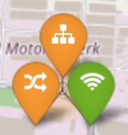
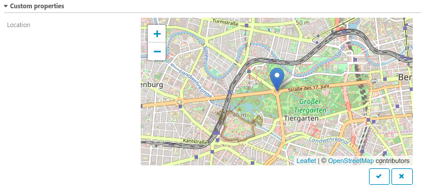

# Add markers to your map

## Add coordinates to a host object in Icinga 2

Add a custom attribute called `geolocation` to any host you want to display on the map. Its value consists of WGS84 coordinates in the following format:

```
vars.geolocation = "<latitude>,<longitude>"
```

In order to highlight the host's coordinate, hold the CTRL key and click on the desired map location. A popup will show you the coordinates of the clicked point in the correct geolocation format, so you could just copy & paste the text.

### Example of a host object

```
object Host "db-in-la" {
  check_command = "hostalive"
  address = "192.168.33.5"
  vars.geolocation = "34.052234,-118.243685"
}
```

Don't forget to reload your icinga2 daemon after adding items to your config.

### Assign coordinates in a more generic way

There is also an [article](https://www.icinga.com/2017/08/16/integrate-maps-into-icinga/) in the icinga blog describing a more automated way of adding coordinates by matching your hostname conventions.

### Assign different marker icons

Add a custom attribute called `map_icon` to an object already having the custom attribute `geolocation`. Its value must be a name of an icon from the iconfont used in Icinga Web 2 which you can find at /icingaweb2/doc/style/font when you enable the doc module.

```
vars.map_icon = "print"
```

Markers will look like the following example showing the icons sitemap, flapping and wifi.




## Using the Icinga Director

If you're using the [Icinga Director](https://github.com/icinga/icingaweb2-module-director), you could use the new [mapDatatype](https://github.com/nbuchwitz/icingaweb2-module-mapDatatype) plugin. This plugin enables you to directly selected your coordinates on a map.




## What's next?

After adding the first markers to your map, you wan't to [explore the map](03-Exploring-the-map.md).
